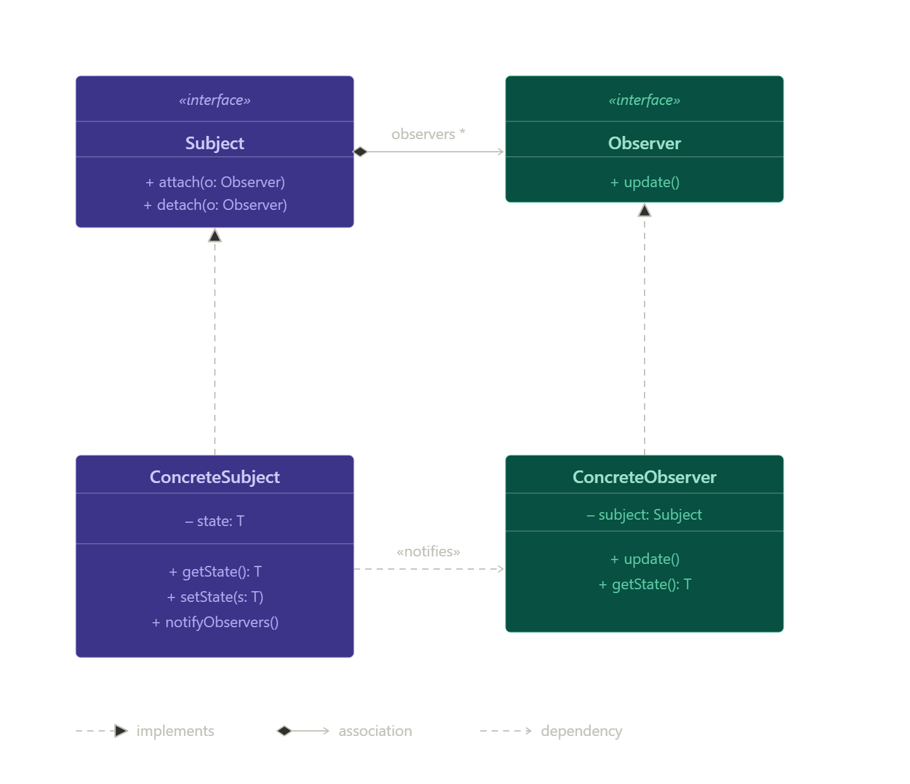

# Observer Design Pattern

## Definition
Design Pattern بيعمل علاقة one-to-many بحيث تغيير في Subject يتم إبلاغ كل Observers تلقائيًا.

---

## Main Idea
Subject لا يتواصل مباشرة مع الكائنات  
بل “يُبلغ” الجميع عند حدوث تغيير.

---

## Real-world Analogy
YouTube:

- Channel = Subject
- Subscribers = Observers
- Upload video → notify الجميع

---

## Problem it solves
- صعوبة تحديث كائنات كثيرة يدويًا
- Tight Coupling
- تكرار الكود عند كل تغيير

---

## Why this problem happens
الكائنات تعتمد على بعضها مباشرة  
مفيش فصل بين البيانات والمستقبلين

---

## Solution
- Subject يحتفظ بقائمة Observers
- عند التغيير ينادي notify()
- كل Observer يحدث نفسه

---

## Structure / Components
- Subject
- Observer
- ConcreteSubject
- ConcreteObserver

---

## UML

---

## Participants
- Subject: يدير observers
- Observer: interface للتحديث
- ConcreteSubject: ينفذ state
- ConcreteObserver: ينفذ رد الفعل

---

## How it works internally
- observers تعمل subscribe
- Subject يخزنهم
- state يتغير
- notify all observers

---

## Step-by-step flow
- create subject
- attach observers
- change state
- call notify()
- observers update

---

## When to use
- notifications systems
- stock market updates
- UI updates
- event-driven systems

---

## When NOT to use
- systems بسيطة
- عدد observers قليل جدًا
- performance critical + updates كثيرة جدًا

---

## Advantages
- Loose coupling
- extensibility
- dynamic behavior
- easy maintenance

---

## Disadvantages
- overhead عند كثرة observers
- debugging صعب
- ممكن memory leaks لو detach اتنسى

---

## Performance impact
- متوسط في الطبيعي
- يقل الأداء لو observers كتير أو updates متكررة

---

## Spring Boot usage
- Spring Events
- @EventListener
- ApplicationEventPublisher

👉 Spring = Observer pattern + Event-driven architecture

---

## Implementation steps
- create Observer interface
- create Subject interface
- implement concrete classes
- attach observers
- trigger notify()

---

## Best practices
- use interfaces
- avoid tight coupling
- prefer async for large systems
- always manage detach

---

## Common mistakes
- forgetting detach → memory leak
- too many observers
- heavy logic inside notify()

---

## Comparison
- Observer → state change → notify others
- Strategy → change behavior
- Command → wrap request
- Mediator → central communication hub  