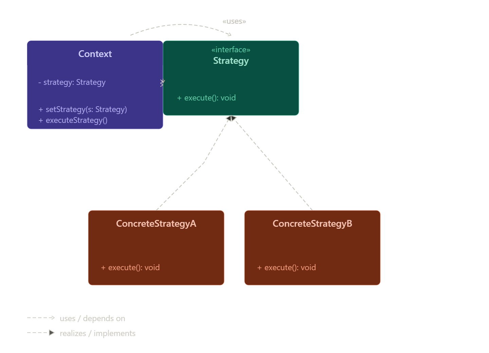

# Strategy Pattern هو Behavioral Design Pattern

## Definition
Pattern بيخلي عندنا أكتر من Algorithm  
ونقدر نبدل بينهم وقت التشغيل Runtime.

---

## Main Idea
بدل if/else الكتير  
نفصل كل behavior في Class مستقلة.

---

## Real World Analogy
Google Maps:

- Car
- Walking
- Metro

كل طريقة = Strategy مختلفة.

---

## Problem
لما يكون عندنا:

- أكتر من طريقة لتنفيذ نفس العملية
- if/else كتير
- كود معقد

---

## Why Problem Happens
لأن كل الـ algorithms موجودة داخل Class واحدة.

---

## Solution
نفصل كل Algorithm في:

- Separate Class
- وكلهم يطبقوا Interface واحدة

---

## Structure

| Component         | Role                |
|------------------|-------------------|
| Strategy          | Interface           |
| Concrete Strategy | تنفيذ مختلف         |
| Context           | يستخدم الـ strategy |
| Client            | يختار strategy      |

---

## UML

---

## How It Works

- Client يختار Strategy
- يبعته للـ Context
- Context يستدعي method
- Strategy تنفذ المطلوب

---

## When To Use

- أكتر من Algorithm
- تبديل behavior أثناء التشغيل
- if/else كثيرة
- تطبيق Open/Closed Principle

---

## When NOT To Use

- Algorithm واحدة فقط
- مشروع بسيط
- مفيش تغيير متوقع

---

## Advantages

- Loose Coupling
- سهل إضافة behavior جديد
- يقلل if/else
- أسهل Testing
- Flexible

---

## Disadvantages

- عدد Classes أكبر
- أحيانًا Overengineering
- محتاج فهم للـ strategies

---

## Performance Impact

- Objects أكثر قليلًا
- Method calls إضافية بسيطة

لكن غالبًا الأداء ممتاز.

---

## Spring Boot Usage

Spring يستخدمه في:

- Authentication
- Notification services
- Payment services
- Message converters

---

## Implementation Steps

- تحديد الـ algorithms
- إنشاء Interface
- إنشاء Concrete Strategies
- إنشاء Context
- اختيار Strategy من Client

---

## Best Practices

- استخدم Interface واضحة
- استخدم Dependency Injection
- خلي كل Strategy مستقلة
- اتبع Open/Closed Principle

---

## Common Mistakes

- وضع logic داخل Context
- استخدام pattern بدون داعي
- Strategies كثيرة جدًا

---

## Comparison

| Pattern         | Purpose                     |
|----------------|---------------------------|
| Strategy        | تغيير algorithm             |
| State           | تغيير behavior حسب state    |
| Command         | تحويل request لـ object     |
| Template Method | inheritance بدل composition |

---

## Difference Between Strategy and State

### Strategy
الـ Client يختار behavior.

### State
الـ Object يغير behavior تلقائيًا حسب الحالة.