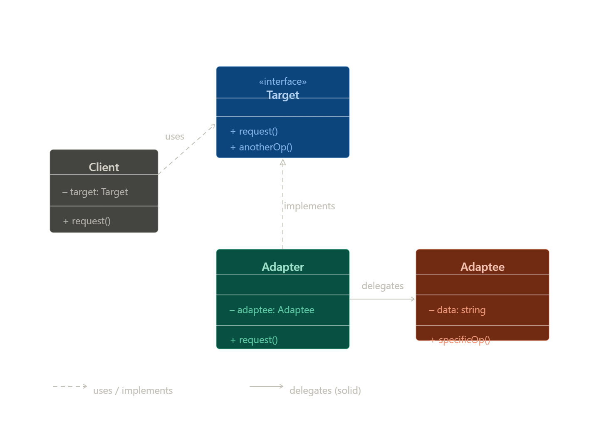

# Adapter Pattern - Structural Design Pattern

## Definition
Adapter Pattern هو Pattern بيحوّل Interface لكلاس موجود إلى Interface تاني متوافق مع الـ Client.

---

# Main Idea
يعمل كـ “Translator” بين كلاسين غير متوافقين.

---

# Real World Analogy
 Adapter الشاحن

---

# Problem It Solves
حل مشكلة عدم توافق الـ Interfaces بين الكلاسات.

---

# Why Problem Happens
- اختلاف Interfaces
- Legacy Code
- استخدام Third-party Libraries
- دمج Systems مختلفة

---

# Solution
إنشاء Adapter Class يقوم بـ:
- استقبال الطلب من الـ Client
- تحويل الطلب للكلاس الحقيقي

---

# Components

| Component | Role |
|-----------|------|
| Client | المستخدم |
| Target | الـ Interface المطلوب |
| Adapter | المترجم |
| Adaptee | الكلاس القديم |

---

# UML Diagram

---

# How It Works

1. Client يرسل Request
2. Adapter يستقبل الطلب
3. Adapter يحوّل الطلب
4. ينادي Adaptee
5. يرجّع النتيجة

---

# When To Use

- عند اختلاف Interfaces
- مع Legacy Systems
- مع APIs خارجية
- إعادة استخدام كود قديم

---

# When NOT To Use

- لو مفيش اختلاف Interfaces
- لو تقدر تعدل الكود بسهولة
- لو هيزيد التعقيد بدون داعي

---

# Advantages

- Reusability
- Loose Coupling
- سهولة دمج الأنظمة
- تطبيق Open/Closed Principle

---

# Disadvantages

- زيادة عدد الكلاسات
- زيادة التعقيد
- Performance Overhead بسيط

---

# Performance Impact

يوجد Overhead بسيط بسبب وجود طبقة إضافية (Adapter).

---

# Spring Usage

في Spring Security:
يتم تحويل User Entity إلى UserDetails باستخدام Adapter Pattern.

---

# Implementation Steps

1. تحديد Target Interface
2. تحديد Adaptee
3. إنشاء Adapter
4. تحويل Requests
5. استخدام Adapter مع Client

---

# Best Practices

- استخدم Composition
- حافظ على بساطة Adapter
- لا تضع Business Logic داخله

---

# Common Mistakes

- استخدامه بدون داعي
- وضع Business Logic داخل Adapter
- تحويله إلى God Class

---

# Comparison With Similar Patterns

| Pattern | الفرق |
|---------|--------|
| Adapter | تحويل Interface |
| Decorator | إضافة Behavior |
| Facade | تبسيط System |
| Proxy | التحكم في الوصول |

---

# Key Idea

> Adapter = Compatibility Between Different Interfaces