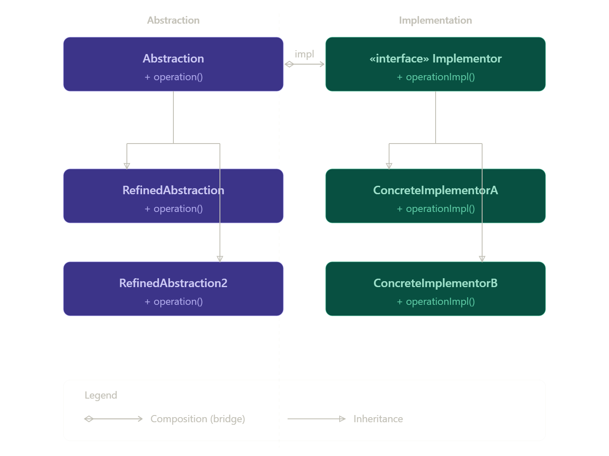

# Bridge Design Pattern

## Definition

Bridge Pattern هو Structural Design Pattern  
بيفصل بين:

Abstraction  
Implementation

بحيث كل واحد يقدر يتغير بشكل مستقل.

---

## Main Idea

بدل استخدام inheritance بشكل كبير  
بنستخدم composition.

يعني:  
الكلاس يحتوي object بدل ما يرث منه.

---

## Problem

لما يكون عندنا:

أكتر من abstraction  
وأكتر من implementation

عدد الكلاسات بيزيد جدًا  
وده اسمه:

Class Explosion

---

## Solution

نفصل:

الـ abstraction  
عن  
الـ implementation

عن طريق Bridge.

---

## Real World Example

Remote + TV  
Remote = abstraction  
TV = implementation

---

## Structure

---

## Components:

| Component           | الوظيفة           |
| ------------------- | ----------------- |
| Abstraction         | الواجهة الأساسية  |
| RefinedAbstraction  | نسخة متطورة       |
| Implementor         | interface للتنفيذ |
| ConcreteImplementor | التنفيذ الحقيقي   |

---

## How It Works

الـ abstraction يمسك implementor.  
أي request يتم تفويضه للتنفيذ الحقيقي.  
نقدر نغير التنفيذ بدون تعديل الـ abstraction.

---

## When To Use

لو عندك تغييرات متعددة.  
لو عايز تقلل inheritance.  
لو عايز flexibility.  
لو فيه combinations كتير.

---

## When NOT To Use

لو النظام بسيط.  
لو مفيش تغييرات كثيرة.  
لو inheritance كافي.

---

## Advantages

Loose Coupling  
Flexible  
Easy Extension  
يقلل عدد الكلاسات  
سهل الصيانة

---

## Disadvantages

زيادة التعقيد  
عدد كلاسات أكبر  
أصعب للمبتدئين

---

## Performance

فيه delegation زيادة بسيطة  
لكن التأثير غالبًا ضعيف جدًا.

---

## Spring Example

Spring Data JPA:

Repository = abstraction  
Hibernate = implementation

وده قريب من فكرة Bridge.

---

## Best Practices

استخدم composition  
افصل المسؤوليات  
استخدم interfaces  
استخدمه عند الحاجة فقط

---

## Common Mistakes

استخدامه في systems بسيطة  
خلط abstraction مع implementation  
استخدام inheritance بدل composition

---

## الفرق بينه وبين Patterns تانية

| Pattern   | الفرق                              |
| --------- | ---------------------------------- |
| Bridge    | يفصل abstraction عن implementation |
| Adapter   | يحول interface                     |
| Strategy  | يغير behavior                      |
| Decorator | يضيف functionality                 |