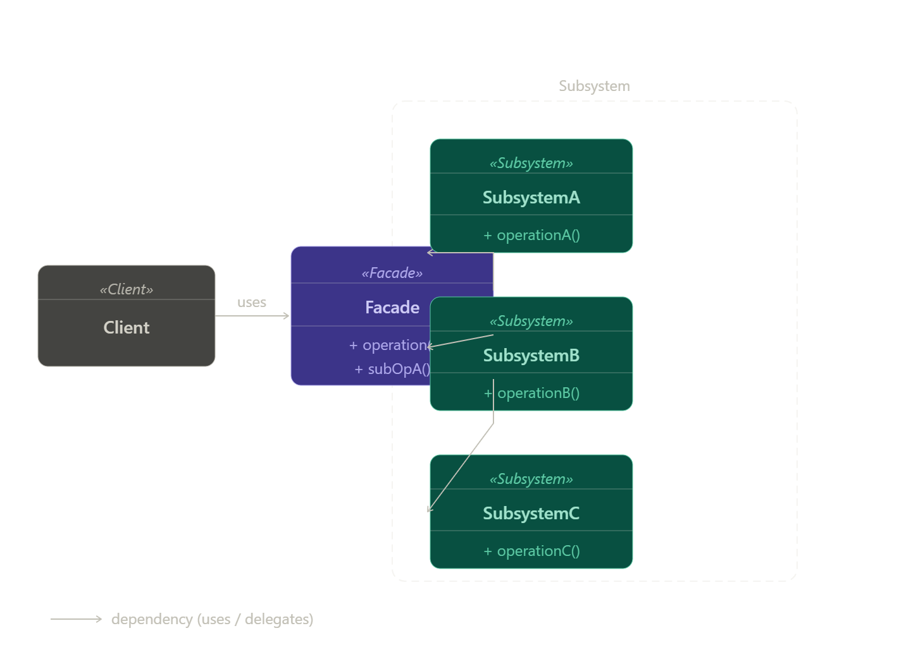

# Facade Pattern

## Facade Pattern هو:
Structural Design Pattern بيقدّم واجهة بسيطة للتعامل مع نظام معقد يحتوي على Classes كثيرة.

---

## Main Idea
بدل ما الـ Client يتعامل مع Classes كثيرة وخطوات معقدة،  
يتعامل مع Facade Class واحدة فقط،  
وهي تتولى تنفيذ باقي العمليات.

---

## Real-world Analogy
 شباك تذاكر السينما

أنت تتعامل مع شخص واحد فقط،  
لكن خلف الكواليس يوجد:

- حجز مقاعد
- دفع
- تشغيل الفيلم
- تنظيم القاعة

الشخص الموجود في الشباك يمثل الـ Facade.

---

## Problem it solves
عندما يكون النظام:
- معقد
- يحتوي على Classes كثيرة
- يحتوي على Dependencies كثيرة

فيصبح استخدامه صعبًا على الـ Client.

---

## Why this problem happens
- زيادة عدد الـ Classes
- وجود Tight Coupling
- العمليات موزعة على عدة أجزاء
- الـ Client يحتاج معرفة تفاصيل كثيرة

---

## Solution
إنشاء Facade Class تقوم بـ:
- تجميع العمليات
- إخفاء التعقيد
- تقديم واجهة سهلة وبسيطة

---

## Structure / Components
- Client
- Facade
- Subsystem Classes

---

## UML Diagram
Client → Facade → Subsystems

---

## Participants / Roles

### Client
المستخدم الذي يطلب الخدمة.

### Facade
الواجهة البسيطة التي تنسّق العمليات.

### Subsystems
الكلاسات التي تنفذ العمل الحقيقي.

---

## How it works internally
- الـ Client يرسل الطلب إلى الـ Facade
- الـ Facade يستدعي الـ Subsystems
- الـ Subsystems تنفذ العمليات
- الـ Facade يرجع النتيجة النهائية

---

## Step-by-step execution flow
- Client يستدعي Facade
- Facade يبدأ تنفيذ العملية
- استدعاء Subsystems
- تنفيذ العمليات المطلوبة
- إرجاع النتيجة

---

## When to use it
- النظام معقد
- يوجد Classes كثيرة
- نريد تبسيط التعامل
- نريد تقليل Coupling

---

## When NOT to use it
- النظام بسيط
- لا يوجد تعقيد حقيقي
- لا حاجة لواجهة موحدة

---

## Advantages
- تبسيط النظام
- تقليل Coupling
- سهولة الاستخدام
- تحسين تنظيم الكود
- سهولة الصيانة

---

## Disadvantages
- قد يتحول إلى God Class
- إضافة Layer إضافية
- قد يخفي تفاصيل مهمة

---

## Performance Impact
يوجد Overhead بسيط بسبب Layer إضافية  
لكن غالبًا لا يؤثر على الأداء بشكل ملحوظ

---

## Spring Boot Usage Example
في Spring Boot غالبًا يتم إنشاء Facade Service لتجميع عدة Services مثل:

- PaymentService
- InventoryService
- ShippingService

---

## Implementation Steps
- تحديد الـ Subsystems المعقدة
- إنشاء Facade Class
- وضع التنسيق داخل الـ Facade
- جعل الـ Client يتعامل مع الـ Facade فقط

---

## Best Practices
- اجعل الـ Facade بسيطًا
- استخدمه للتنسيق فقط
- لا تضع Business Logic داخله
- قسّم الـ Facade إذا كبر النظام

---

## Common Mistakes
- تحويل Facade إلى God Class
- استخدامه في أنظمة بسيطة
- وضع كل الـ Logic داخله

---

## Comparison

### Facade vs Adapter
- Facade → يبسط النظام
- Adapter → يغير الـ Interface

### Facade vs Proxy
- Facade → يسهل الاستخدام
- Proxy → يتحكم في الوصول

---

## Summary
Facade Pattern يهدف إلى تبسيط التعامل مع الأنظمة المعقدة عن طريق توفير واجهة واحدة بسيطة.