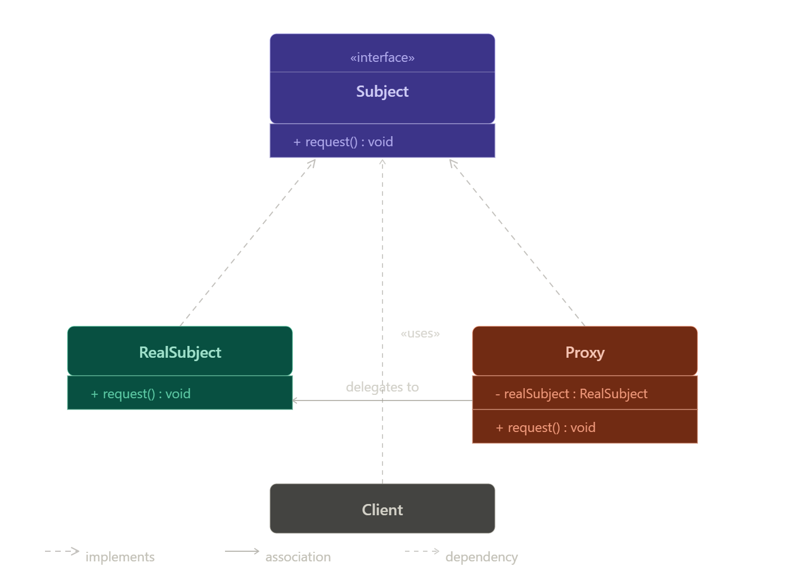

# Proxy Design Pattern

## Definition
Proxy Design Pattern هو **Structural Design Pattern** بيقدّم كائن وسيط (Proxy) بيقف بين الـ Client والـ Real Object للتحكم في الوصول له أو إضافة سلوك قبل/بعد التنفيذ.

---

# Main Idea

بدل ما الـ Client يتعامل مباشرة مع الكائن الحقيقي، بيتعامل مع Proxy:

- Proxy يمرّر الطلب أو يتحكم فيه
- بدون تعديل الكود الأصلي

---

# Real World Analogy

## سكرتير المدير

العميل → السكرتير → المدير

السكرتير يتحكم في الوصول للمدير.

---

# Problem it solves

- كائنات ثقيلة في الإنشاء
- الحاجة للتحكم في الوصول (Security)
- الحاجة لتحسين الأداء (Caching / Lazy loading)
- عدم الرغبة في تعديل الكود الأصلي

---

# Why this problem happens

- بعض العمليات مكلفة (Database / File / Network)
- بعض الكائنات حساسة
- بعض العمليات مش لازم تتنفذ كل مرة

---

# Solution

إضافة Proxy Class:

- نفس الـ Interface
- يتحكم في الوصول
- ينفذ أو يمنع أو يحفظ نتيجة

---

# Structure

- Subject (Interface)
- RealSubject (الكائن الحقيقي)
- Proxy (الوسيط)

---

# Participants / Roles

- **Client** → المستخدم
- **Subject** → Interface مشترك
- **RealSubject** → التنفيذ الحقيقي
- **Proxy** → التحكم في الوصول

---

# UML Diagram

---

# How it works

1. Client ينادي Proxy
2. Proxy يعمل Check
3. Proxy يقرر:
    - ينفذ Real Object
    - أو يرجع Cached Result
    - أو يمنع التنفيذ
4. النتيجة ترجع للـ Client

---

# Step-by-step Flow

1. طلب من Client
2. Proxy يستقبل الطلب
3. Proxy يعمل Validation / Caching / Security
4. Proxy ينفذ أو يرفض أو يرجع نتيجة
5. النتيجة ترجع

---

# When to use it

- Lazy Loading
- Security Control
- Logging
- Caching
- Remote Services

---

# When NOT to use it

- النظام بسيط
- مفيش سبب لطبقة إضافية
- الأداء حساس جدًا ومش محتاج Overhead

---

# Advantages

- حماية (Security)
- تحسين الأداء (Caching)
- Lazy Loading
- فصل المسؤوليات
- بدون تعديل الكود الأصلي

---

# Disadvantages

- زيادة التعقيد
- زيادة عدد الكلاسات
- ممكن يضيف Latency بسيط

---

# Performance Impact

- فيه Overhead بسيط
- لكن ممكن يحسن الأداء لو فيه Caching أو Lazy Loading

---

# Real-world Project Examples

- Image Loading Apps (Lazy Loading)
- API Gateway
- Database Connections
- Logging & Security Layers

---

# Spring Boot Usage

## @Transactional

Spring بيعمل Proxy:

- يبدأ Transaction
- ينفذ Method
- Commit / Rollback

---

## AOP (Logging / Security)

Spring بيستخدم Proxy خلف الكواليس لإضافة Behavior بدون تعديل الكود.

---

# Implementation Steps

1. Create Interface
2. Create RealSubject
3. Create Proxy Class
4. Proxy ينفذ نفس الـ Interface
5. Add Control Logic داخل Proxy
6. استخدم Proxy بدل Real Object

---

# Best Practices

- نفس الـ Interface للـ Proxy والـ Real
- خليه خفيف
- لا تضع Business Logic كبير فيه
- استخدمه عند الحاجة فقط

---

# Common Mistakes

- استخدامه بدون داعي
- خلطه مع Decorator
- وضع Logic كبير داخل Proxy
- زيادة التعقيد بدون فائدة

---

# Comparison with Decorator

| Proxy | Decorator |
|------|------|
| يتحكم في الوصول | يضيف وظائف |
| ممكن يمنع التنفيذ | لا يمنع |
| هدفه حماية / تحكم | هدفه توسعة السلوك |
