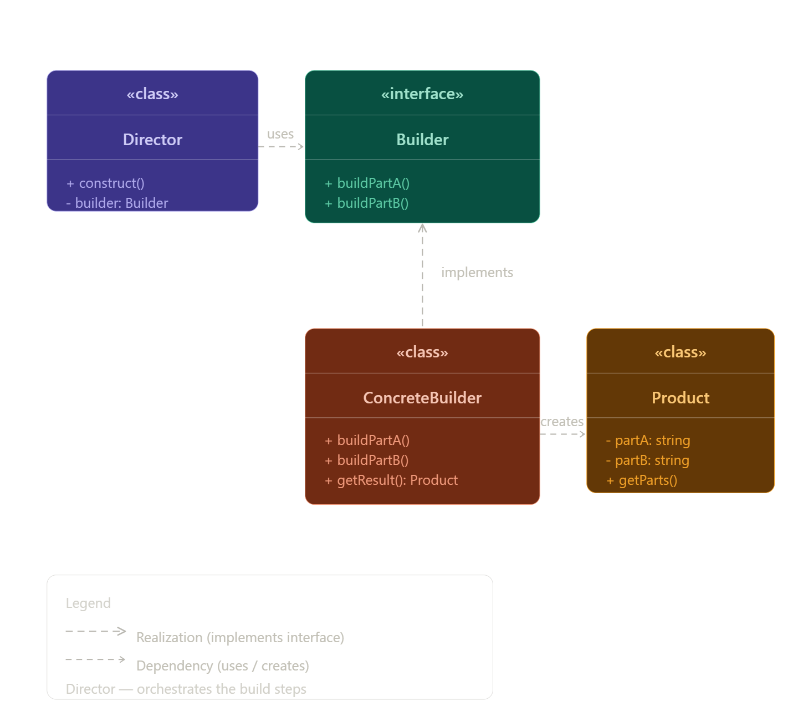

Builder Design Pattern (Intent)

هو Creational Design Pattern بيستخدم لبناء Objects معقدة خطوة خطوة (step by step) بدل ما نبنيها مرة واحدة في Constructor كبير ومعقد.

بيسمح إنك تستخدم نفس طريقة البناء عشان تطلع أشكال مختلفة من نفس الـ Object حسب الاختيارات (variations).

إمتى أستخدم Builder؟
لما الـ object يكون فيه حاجات كتير optional
لما constructor يبقى طويل ومش مفهوم
لما عايز أبني object بطريقة منظمة وواضحة

Problem Before Builder Pattern

عند إنشاء Objects معقدة تحتوي على الكثير من الخصائص:

استخدام Subclasses يؤدي إلى عدد كبير جدًا من الـ classes.
استخدام Constructor ضخم يجعل الكود صعب القراءة والفهم.
كثير من الـ parameters قد لا يتم استخدامها.
الكود يصبح معقدًا وصعب الصيانة.

Builder Pattern يحل هذه المشكلة عن طريق بناء الـ Object خطوة بخطوة بطريقة مرنة ومنظمة.

Pattern solution
يقوم Builder Pattern بفصل كود إنشاء الـ Object عن الـ Class الأساسية ووضعه داخل Builder Classes مستقلة.

يتم بناء الـ Object خطوة بخطوة باستخدام methods مثل:

buildWalls()
buildDoor()
buildRoof()

يمكن استخدام نفس خطوات البناء لإنشاء أشكال مختلفة من الـ Object عن طريق استخدام Builders مختلفة.

كل Builder ينفذ خطوات البناء بطريقته الخاصة.

Director

هو Class مسؤول عن تحديد ترتيب خطوات البناء.

يساعد على:

تنظيم عملية البناء
إعادة استخدام خطوات البناء
إخفاء تفاصيل الإنشاء عن الـ Client

Structure of Builder Pattern
1. Builder Interface
يحتوي على خطوات البناء المشتركة بين جميع الـ Builders.

2. Concrete Builders
تنفذ خطوات البناء بطرق مختلفة لإنتاج أشكال مختلفة من الـ Product.

3. Product
هو الـ Object النهائي الذي يتم بناؤه.

4. Director
مسؤول عن ترتيب وتنظيم خطوات البناء.

5. Client
يقوم بربط الـ Builder مع الـ Director وبدء عملية البناء.

How to Implement Builder Pattern
تحديد خطوات البناء المشتركة بين جميع المنتجات. 1
إنشاء Builder Interface يحتوي على خطوات البناء مثل: 2
setSeats()
setEngine()
setGPS()
إنشاء Concrete Builders مختلفة لتنفيذ خطوات البناء بطرق مختلفة. 3
إضافة method مثل: 4
getProduct()
لإرجاع الـ Product النهائي.
يمكن إنشاء Director لتنظيم وترتيب خطوات البناء. 5

الـ Client ينشئ: 6
Builder
Director

ثم يبدأ عملية البناء.
بعد انتهاء البناء يتم الحصول على المنتج النهائي من الـ Builder. 

Pros
بناء الـ Object خطوة بخطوة.
إعادة استخدام نفس خطوات البناء لمنتجات مختلفة.
فصل كود البناء عن الـ Business Logic.
مرونة أكبر في إنشاء Objects معقدة.

Cons
زيادة عدد الـ Classes.
زيادة تعقيد الكود في المشاريع الصغيرة.

Relations with Other Patterns
قد تبدأ المشاريع باستخدام Factory Method ثم تتحول إلى Builder عند زيادة تعقيد الـ Objects.
Builder يبني الـ Object خطوة بخطوة، بينما Abstract Factory ينشئ الـ Objects مباشرة.
Builder مناسب لبناء الـ Composite Trees المعقدة.
يمكن دمج Builder مع Bridge:
الـ Director يعمل كـ Abstraction
والـ Builders تعمل كـ Implementations
يمكن تطبيق Singleton على:
Builder
Abstract Factory
Prototype

Performance Impact
Builder بيزود شوية كود وكلاسات، فده بيعمل:
زيادة في عدد الـ objects
شوية overhead في الذاكرة
لكنه مش تأثير كبير في أغلب الحالات

Spring Boot usage
 في Spring Boot بنستخدم Builder غالبًا بطريقة جاهزة مش بنكتبها بإيدنا
@Builder
من Lombok

Spring/Lombok بيعملوا Builder بدل ما تكتبيه إيدك

