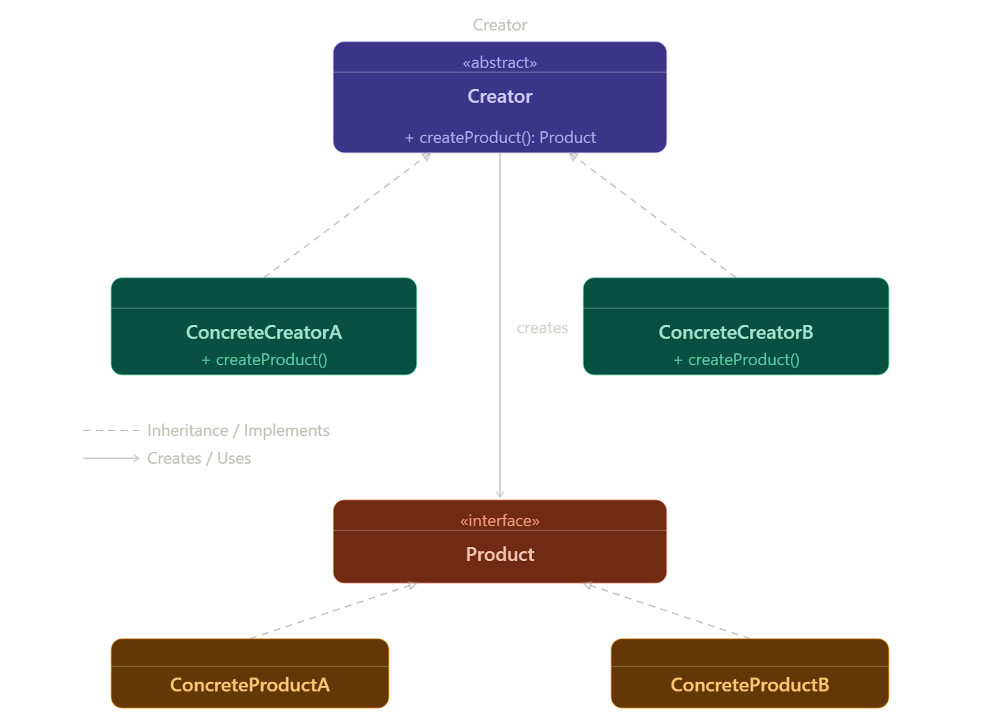

ما هو الـ Factory Method؟
هو Creational Design Pattern مسؤول عن إنشاء الـ Objects بدل إنشائها بشكل مباشر، بينما تقوم الـ Subclasses بتحديد نوع الـ Object المناسب عن طريق Override.

💡 الفكرة الأساسية
فصل إنشاء الـ Object عن استخدامه، بحيث الـ Creator يعرف إنه محتاج Object لكن لا يحدد نوعه، ويتم تحديد النوع داخل الـ Subclasses عن طريق Factory Method.

🚗 مثال من الواقع (Real-world Analogy)
تخيل مصنع سيارات، عندك:

CarFactory (abstract): بتحدد فكرة إنتاج السيارات بشكل عام.

ToyotaFactory: بتنتج سيارات Toyota.

BMWFactory: بتنتج سيارات BMW.

مدير الإنتاج (Client): بيقول "عايز عربية" من غير ما يحدد الموديل، والمصنع الـ Concrete Factory هو اللي يحدد ويقرر نوع العربية اللي هتتعمل فعليًا.

⚠️ المشكلة (The Problem)
إنشاء الـ Objects يتم باستخدام if/else داخل نفس الكود، وبالتالي عند إضافة أي نوع جديد نضطر نعدل في الكود القديم، وهذا يجعل الكود غير مرن ويخالف مبدأ Open/Closed Principle.

مثال للكود السيئ:
// مشكلة: الكود مربوط بـ concrete class
Notification n;
if (type.equals("email")) {
n = new EmailNotification();
} else if (type.equals("sms")) {
n = n = new SMSNotification();
} else if (type.equals("push")) {
n = new PushNotification();  
}

المشكلة دي بتحصل لأن الـ Client بيكون مسؤول عن معرفة كل الـ Concrete Classes وطريقة إنشائها، وده بيؤدي إلى Tight Coupling بين الكود والـ Implementations.

الحل (The Solution)
أن كل Subclass تقوم بإنشاء نوع الـ Object الخاص بها باستخدام Factory Method بدل ما الـ Client ينشئه مباشرة.

الدور,المسؤولية
Creator (abstract),بيعرّف الـ factoryMethod() وممكن يحتوي على logic مشتركة.
ConcreteCreator,بيـ override الـ factoryMethod() ويرجع الـ Concrete Product.
Product (interface),الـ interface اللي كل الـ Products بتنفذه.
ConcreteProduct,التنفيذ الفعلي للـ Product.

تسلسل الخطوات (Step-by-step Flow)
الـ Client بيطلب من ConcreteCreator يعمل حاجة.

الـ ConcreteCreator يستدعي createProduct() اللي هو الـ Factory Method.

الـ Factory Method ترجع ConcreteProduct.

الـ Creator يستخدم الـ Product عن طريق الـ Product Interface (من غير ما يعرف النوع الفعلي).

خطوات التنفيذ (Implementation Steps)
تعريف Product Interface: بيحدد شكل الـ products.

إنشاء Concrete Products: كل نوع ينفذ الـ interface.

إنشاء Abstract Creator: فيه factory method (abstract) وفيه business logic.

إنشاء Concrete Creators: كل واحد يحدد نوع الـ product.

الاستخدام في Client: تتعامل مع Creator فقط.

إضافة Type جديد: تضيف Product جديد + Creator جديد فقط بدون تعديل القديم.

Factory Method في Spring Framework
Spring Framework يعتمد على Factory Method من خلال BeanFactory و ApplicationContext لإدارة وإنشاء الـ Beans بدل إنشاءها يدويًا.

🧠 الفكرة العامة في Spring:
بدل ما أنت تعمل object بـ new بنفسك، Spring هو اللي بيصنعه ويرجعه لك جاهز.

📌 أين يظهر في Spring؟
Beans (getBean): الربيع هو المسؤول عن صنع الـ Beans.

FactoryBean: كلاس داخل Spring بيصنع Beans معقدة.

LoggerFactory: بيختار ويعمل Logger مناسب تلقائيًا.

SessionFactory (Hibernate): بيصنع Session جاهزة.

WebClient Builder: بيبني object جاهز بإعدادات بدل new.

⚖️ المميزات والعيوب
✔️ المميزات:
Open/Closed Principle.

فصل الـ Creation عن الـ Usage.

سهل الاختبار (Testable).

❌ العيوب:
بيزود عدد الكلاسات.

ممكن يكون Overkill في الحالات البسيطة.

معقد للمبتدئين.

⚡ تأثير الأداء
تأثيره على الأداء بسيط جدًا ومش بيبان في الاستخدام العادي (مجرد Method Call).

📌 إمتى ممكن يبان فرق؟ فقط لو بنعمل عدد ضخم جدًا من الـ objects في loops سريعة جدًا.

🧠 ملاحظة: Java بتعمل تحسينات (JIT Compiler) فبتقلل أي بطء ممكن يحصل.

النمط,الوصف,مثال
Factory Method,ينشئ نوع واحد من الـ objects عبر الـ Subclasses.,Email / SMS
Abstract Factory,ينشئ مجموعة (Family) من objects مرتبطين ببعض.,Dark UI (Button + Text)
Builder,ينشئ object معقد خطوة بخطوة.,User / Request كبير

أخطاء شائعة (Common Mistakes)
إنك ترجع ConcreteProduct بدل الـ Interface.

إنك تحط Business Logic جوه الـ Factory Method.

إنك تعمل الـ Creator مش Abstract.

استخدامه وعندك نوع واحد بس (Overkill).

تسمية الـ Factory Method باسم غير واضح.

يُستخدم Factory Method عندما لا نعرف نوع الكائن مسبقًا ونحتاج إلى مرونة، ويجب أن يكون مرنًا، واضحًا، ويرجع Interface. لو التصميم بسيط جدًا، استخدم Simple Factory لتجنب التعقيد الزائد.