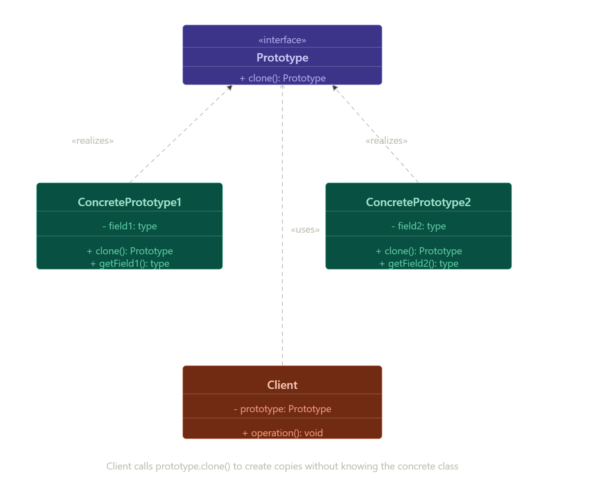

Prototype هو Creational Design Pattern.
فكرته إنه يعمل Copy / Clone لكائن موجود بالفعل.
بيخلينا ننشئ Objects جديدة بدون البناء من الصفر.
بيساعد إن الكود ميعتمدش على Class معين بشكل مباشر.
يُستخدم لما إنشاء الـ Object يكون معقد أو مكلف.

يُعرف أيضًا باسم:

Prototype = Clone Pattern

Problem Note
لو عايزين نعمل نسخة من Object بالطريقة العادية:
ننشئ Object جديد من نفس الـ Class.
ننسخ كل الـ Fields يدويًا.
المشكلة إن بعض الـ Fields تكون private
وبالتالي لا يمكن الوصول لها من خارج الـ Object.
لازم نعرف نوع الـ Class الحقيقي للكائن علشان نعمل نسخة منه،
وده يعمل Dependency على الـ Class.
أحيانًا نعرف فقط الـ Interface وليس الـ Concrete Class،
لذلك لا نستطيع إنشاء نسخة مباشرة.
Prototype Pattern يحل المشكلة بأن الـ Object نفسه يقوم بعمل Clone لنفسه.

Note (Prototype – Solution)
الـ Prototype Pattern بيخلّي عملية النسخ تتم داخل الـ Object نفسه بدل ما الكود الخارجي يعملها.
بيتم تعريف Interface مشترك لكل الـ objects اللي تدعم النسخ، وبيكون فيه غالبًا method واحدة اسمها clone().
ده بيسمح بعمل نسخة من الـ Object بدون ما يكون الكود مرتبط بالـ Class الحقيقي (بدون coupling).
كل Class بيقوم بتنفيذ clone() بطريقته:
ينشئ Object جديد من نفس الـ Class.
ينسخ كل قيم الـ fields من الـ Object القديم للجديد.
ممكن نسخ الـ private fields لأن نفس الـ Class يقدر يوصل لها داخل عملية النسخ.
الـ Object اللي بيدعم النسخ اسمه Prototype.
الـ Pattern مفيد لما يكون الـ Object معقد أو له إعدادات كثيرة، وبيكون بديل عن إنشاء كائنات جديدة أو subclassing.

Note (Real-World Analogy – Prototype)
الـ Prototype Pattern يشبه انقسام الخلية (Mitotic Cell Division)، لأن الكائن نفسه هو اللي بيعمل نسخة مطابقة منه

Note (Structure – Prototype)
الـ Prototype Interface بيعلن عن عملية النسخ (clone method)، وغالبًا بتكون method واحدة.
الـ Concrete Prototype Class هو اللي بينفذ عملية الـ clone:
بيعمل Object جديد.
بينسخ بيانات الـ Object الأصلي.
ممكن يتعامل مع حالات معقدة زي الـ linked objects أو العلاقات الداخلية.
الـ Client هو اللي بيستخدم الـ prototype:
بيطلب نسخة من الـ Object عن طريق clone().
بدون ما يحتاج يعرف تفاصيل الـ Class أو طريقة الإنشاء.

UML (Prototype Pattern)

Note (Prototype Registry)
الـ Prototype Registry هو مخزن بيحفظ Objects جاهزة للنسخ (prototypes).
بدل ما ننشئ Object من الصفر، بنجيب Object جاهز من الـ registry ونعمله clone.
الـ registry بيكون غالبًا عبارة عن:
name → prototype (map / hash map)
بنستخدم الاسم عشان نوصل للـ Object المطلوب.
مثال:
registry.get("car").clone()
الفكرة: تسهيل الوصول للـ prototypes الجاهزة بدل إنشاءها كل مرة.

c1.clone() → بنستخدمها لما يكون الـ object موجود بالفعل في الإيد مباشرة، فبنعمل له نسخ.
registry.get(...).clone() → بنستخدمها لما يكون الـ object مخزن في Prototype Registry، فبنجيبه بالاسم الأول وبعدين نعمله clone.

الاتنين بيعملوا Clone
الفرق بس في طريقة الوصول للـ object قبل النسخ
مباشر (c1)
أو من registry بالاسم

(Applicability – Prototype)
نستخدم Prototype Pattern لما الكود ماينفعش يعتمد على الـ concrete classes الخاصة بالـ objects اللي بيعملها copy، خصوصًا لو جاية من مكتبات خارجية (3rd-party) ومش معروف نوعها الحقيقي.
الـ Pattern بيوفر interface عام فيه clone()، وده يخلي الكود مستقل عن نوع الـ object الفعلي.
نستخدمه كمان لما يكون عندنا subclasses كتير بس اختلافها في طريقة الـ initialization فقط، وده بيزود عدد الكلاسات بدون داعي.
بدل الـ subclasses الكتير، بنستخدم prototypes جاهزة بإعدادات مختلفة ونقوم بعمل clone منها بدل إنشاء object جديد أو subclass جديد.

(How to Implement Prototype)
يتم إنشاء Prototype interface يحتوي على method اسمها clone() أو إضافتها لكل الـ classes الموجودة.
كل class لازم يوفر طريقة للنسخ عن طريق constructor خاص (copy constructor) يستقبل نفس نوع الـ object ويقوم بنسخ كل الـ fields.
في حالة الـ inheritance، يتم استدعاء constructor الخاص بالـ parent باستخدام super() لنسخ بياناته.
إذا كانت اللغة لا تدعم overloading، يتم تنفيذ عملية النسخ بالكامل داخل clone() بدل الـ constructor.
الـ clone() غالبًا تكون بسيطة جدًا وتقوم بإنشاء object جديد باستخدام new وتمرير الـ current object.
يجب على كل class override لـ clone() لتجنب إرجاع type غير صحيح (parent بدل subclass).
يمكن إنشاء Prototype Registry لتخزين prototypes جاهزة وإعادة استخدامها عبر البحث (مثلاً باستخدام اسم أو criteria) ثم عمل clone لها بدل إنشاء objects جديدة من الصفر

Pros :
تقدر تعمل clone للـ objects بدون ما ترتبط بالـ concrete class بتاعه.
بتتخلص من تكرار كود الـ initialization لأنك بتستخدم prototypes جاهزة.
أسهل في إنشاء objects معقدة بدل ما تبنيها من الصفر كل مرة.
بيديك بديل للـ inheritance لما يكون عندك إعدادات مختلفة (configuration presets) لأوبجكت معقد.

Cons :
عمل clone لـ objects معقدة فيها روابط دائرية (circular references) بيكون صعب جدًا ومش دايمًا سهل يتنفذ صح.

(Relations with Other Patterns)
Prototype ممكن يستخدم بدل إنشاء objects جديدة من الصفر.
يمكن استخدامه مع:
Abstract Factory
Command
Composite
Decorator
Prototype لا يعتمد على inheritance مثل Factory Method.
أحيانًا يكون بديل أبسط لـ Memento في حفظ حالة الـ object.

(When NOT to use Prototype)
لا يُستخدم Prototype إذا كان إنشاء الـ object بسيط ولا يحتاج cloning.
لا يكون مناسبًا إذا كانت عملية الـ cloning معقدة بسبب circular references أو العلاقات الكثيرة بين الـ objects.
لا يُستخدم إذا كانت الـ objects الجديدة مختلفة تمامًا عن الأصل.

(Performance Impact)
الـ cloning قد يكون أسرع من إنشاء object من الصفر، خصوصًا مع الـ objects المعقدة.
قد يستهلك memory أكثر إذا كان الـ object كبير أو يحتوي على references كثيرة.

(Best Practices)
استخدم Prototype مع الـ objects المعقدة فقط.
تأكد من نسخ جميع الـ fields بشكل صحيح.
استخدم Prototype Registry عند وجود prototypes متكررة.
اجعل clone() يرجّع نفس النوع الصحيح للـ object.

(Common Mistakes)
نسيان نسخ بعض الـ fields.
نسخ الـ references فقط بدل نسخ الـ object بالكامل.
عدم عمل override صحيح لـ clone().
استخدام Prototype مع objects بسيطة بدون حاجة حقيقية له.

